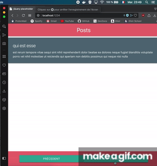

# Tuto jQuery/Materialize

Vous devez implémenter le système de pagination vu en cours.

## Consignes

- Créer de layout avec materialize
- Créer un template en JS (cf : [template string](https://developer.mozilla.org/fr/docs/Web/JavaScript/Reference/Littéraux_gabarits))
- Récuperer le 1er post depuis [JSON placeholder](https://jsonplaceholder.typicode.com)
- Au click sur un bouton faire une nouvelle requête et changer le contenu du post
- En cas d'erreur utilisateur (clique sur précédent alors qu'on est sur le 1er post) afficher une notification indiquant l'erreur utilisateur
- En cas d'erreur réseau afficher une notification indiquant un problème lors de l'appel réseau
- Amusez vous, allez plus loin que ce TP ;)
